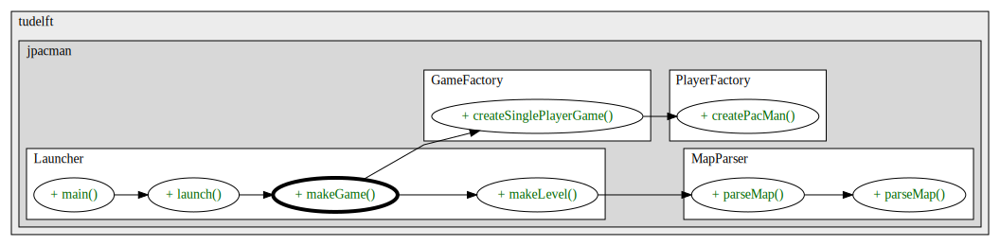

# Assignment 1

## Exercise 1

### Part 1

#### Task
Draw the structure of the project’s packages and classes.
You have to: (i) decide the level of abstraction you want to use in this
depiction, (ii) use natural language to explain your decision,
and (iii) describe what you understood from this depiction of the system

#### Diagram of the project's packages and classes

#### Why was this level of abstraction used?

The graph above depicts a simplified version of a class diagram for the Java Pacman Game. Since there 
are a lot of dependencies between the classes drawing all of the lines between them would've caused lots of confusion
and it would be very difficult to differ between the distinct lines going from one class to another.
Hence to simplify, we used a color coding scheme for each package and only drew the connecting lines between the 
different packages. 

#### Description of the system based on the diagram above

Hereby we learn, that the entire game is divided into 6 larger packages. Most of the classes are inside their respective
packages, only the classes "Launcher" and "PacManConfigurationException" throw exceptions. Initially, we can see that
the class "Launcher" depends on all other packages and imports classes from them. Classes in the packages 
"sprite" and "board" are also imported in most of the other packages. This is logical, since both the board and the 
actual PacMan figure (Sprite) are both fundamental parts of the implementation of a PacMan game. These two packages are 
the main packages of the Java PacManImplementation.

### Part 2

#### Task

Draw a call graph, starting from what you deem the most prominent entry point. You have to: (i)
decide how many levels you want to have in the call graph, (ii) use natural language to explain your
decision, and (iii) explain what you have understood from this call graph about the dynamic behavior
of the system. Hint: this project may have several entry points; those contained in an example or test
folder/class are hardly the most prominent ones

#### Call graph diagram

#### Why was this level of abstraction used?

#### Description of the dynamic behaviour of the system based on the diagram above

The call graph above shows the methods called
to create a PacMan character and its 2D map.

As seen in the diagram, the Main function first calls launch.
As the name suggests, the method "launches" the game in its initial setup.
The makeGame() method is a crucial component to make a
new level(level design and map boundaries) in the game.

At the same time, we step into creating a single Player game inside the created level.
This in turn calls the createPacMan() method and creates the new PacMan character.

## Exercise 2 - A Checkers Game - Design

### Part 1

#### Task
Following the Responsibility Driven Design, start from the game’s requirements and rules and derive
classes, responsibilities, and collaborations (use CRC cards). Describe each step you make and store
the final cards in your answers

#### CRC Cards

#### Description of the steps which lead to these CRC cards

Initially, we identified the different classes by going through the requirements of the game and by 
looking at the rules that we should implement. We separated classes that we knew would turn out to 
be essential from classes which we were uncertain of whether we should implement them. We then, added 
responsibilities to each class as we thought would be adequate. We stumbled upon the problem, that our
"Board" class had too many responsibilities. So, to avoid a confusing project structure, we tried to 
divide the responsibilities onto as many classes as was logical. Lastly, we identified the collaborators 
of the subclasses and added arrows to facilitate getting a quick and easy overview of the class structure 
of our project just by getting a glance at the CRC cards. This would help with the further implementation 
of our classes into the actual code itself.

### Part 2

#### Task
Following the Responsibility Driven Design, describe the main classes you designed to be your
project in terms of responsibilities and collaborations

#### Description of the main classes
In our checkers game design, we have 3 main groups of classes: GameLogic, Board and Rules.

It can be easily identified that, in terms of responsibilities and collaborations, a main 
class we came up with is the GameLogic class. As the name already states, it dictates the 
flow of the game. Examples of its main responsibilities include: Checking whether a move input is valid or if the 
wincondition is met or not. For this, the class collaborates 
with the classes Rules and WinCondition respectively.

Another main class in our design is the Rules class. Despite its lack of collaborators, it acts as a list 
for the possible moves and the pieces found on the board. It validates the possible moves a piece can make, whether it be 
a simple move, jump move, if piece is a king in can move in any direction etc.

The Board class is also a crucial component in our design. It is this class that is responsible for moving the 
pieces around and delete them from the board when captured. The state of the board is thus directly related to 
the win conditions, as one of the win conditions is to check whether any opponent pieces are left on the board.  

### Part 3

#### Task
Why do you consider the other classes as less important? Following the Responsibility Driven Design,
reflect if some of those non-main classes have similar/little responsibility and could be changed,
merged, or removed

In the terms of responsibilities, the other classes such as BoardPrinter and Move do not have many chores 
to perform. The BoardPrinter class prints the board after every move in the terminal. It can be argued that 
this class can be merged with the Board class itself as they both share similarities. The WinCondition can also
be merged with GameLogic. However, this would lead us to our original problem of overloading the classes.

\newpage

### Part 4

#### Task
Draw the class diagram of the aforementioned main elements of your game (do not forget to use
elements such as parametrized classes or association constrains, if necessary)

#### Class diagram

\newpage

### Part 5

#### Task
Draw the sequence diagram to describe how the main elements of your game interact (consider
asynchrony and constraints, if necessary)

#### Sequence diagram

