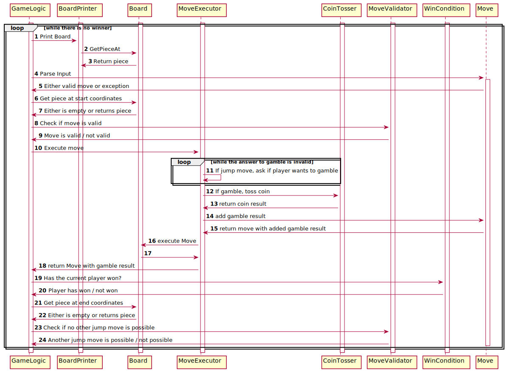

# Assignment 1

## Exercise 1

### Task 1

Where are getters/setters or public variables used in your source code? Refactor nine of these
cases, so that they are not necessary anymore and describe your refactoring/redesign.

### Description of the refactorings

- [x] Board: remove method getBoard

This getter is unused, thus it can safely be refactored.
Was done in [ea632f1](https://github.com/soco21/soco21-group8/commit/ea632f1182b187b326fe2dd593204a4484cf5cdf),
before copying the checkers game.

- [x] Board: remove method getAllPieces

This getter is unused, thus it can safely be refactored.
Was done in [ea632f1](https://github.com/soco21/soco21-group8/commit/ea632f1182b187b326fe2dd593204a4484cf5cdf),
before copying the checkers game.

- [x] Board: move check if it's the last row to Row enum

The row enum can determine itself if it's the last row. This way
we can hide that the coordinates are implemented with an enum.

- [x] Board: move check if it's the firstrow to Row enum

The row enum can determine itself if it's the first row. This way
we can hide that the coordinates are implemented with an enum.

- [x] Move:getCoordinatesBetween: calculate RowIndexBetween in Row

The Row enum can determine itself which row is between itself and another row.

- [x] Move:getCoordinatesBetween: calculate ColIndexBetween in Column

The Column enum can determine itself which column is between itself and another column.

- [ ] Move:isJumpMove: rowDiff in Row berechnen

- [ ] Move:isJumpMove: colDiff in Col berechnen

- [ ] MoveLength: Use the methods in row and col to calculate the difference

## Exercise 2

### Task 1

Google (used to?) ask their employees to spend 20% of their time at Google on a project that their
job description does not cover. As a result of the 20% Project, Google now has services such as
Gmail and AdSense.
This is your occasion to have similar freedom. You can decide what to do next to your game:5 It can
be an extension/improvement from any perspective, such as improved code quality or novel features.
Define your own requirements and get them approved by your tutor (especially in terms of load).
Afterwards you must implement the requirements.

#### Description of the requirements

We decided to implement the following novel feature in our checkers game: 
Before every jump move the current player has the option to toss a coin. If the coin
lands on heads the current player loses its piece and his move is skipped. If its heads,
the players jump move is executed, and he gets to move again.

Additionally, we will fix the bug that the inputs with square brackets ([a3]x[b4]) are accepted,
and that inputs with an uppercase X (a3Xb4, [a3]X[b4]) are accepted too. We implement that by removing
square brackets from the input. Like that, even incomplete inputs ([a3x[b4) are allowed.
The uppercase X is implemented by replacing uppercase x with lowercase x in the input. Because
the change was very small, we didn't create a design document. All the changes are made in Move::parse in
commit [58cb81b](https://github.com/soco21/soco21-group8/commit/58cb81b2c6f519e4b857099ba97a513a7ea15e80).

To improve the readability of the code, we will replace all type inference
using the "var" keyword with explicit type definition. [df5464b](https://github.com/soco21/soco21-group8/commit/df5464bc9009547a2a983f439ddbe8500b8b2197)

To improve the package structure, we moved the Domain Object Model (Board, BoardCoordinates, Move, Piece, Player)
to the separate package dom. [9f4b7d8](https://github.com/soco21/soco21-group8/commit/9f4b7d8f8f85d2cca159e9469ba82ab104f3b547)

To improve the package structure, we moved the util classes (BoardPrinter, Console)
to the separate package util. [3b77746](https://github.com/soco21/soco21-group8/commit/3b777465a1f8a959c6f8ea436b6d97408c2b88f6)

### Task 2

During the analysis and design phases of this extension use responsibility driven design and UML
(push to the repository the single PDF file including all the produced documents)

##### Responsibility Driven Design

##### CRC Cards

That it's possible to write unittests, we extract the random generator to the separate class CoinTosser.
Then we can mock the result.

##### UML

## Exercise 3

### Task 1

Write a natural language description of why and how the pattern is implemented in your code.

#### Description of why and how the pattern is implemented

Currently, the GameLogic decides when to print the board. But the board could also notify 
an Observer when it's state changes, and that observer could print the board.
That way the GameLogic does not need to depend on BoardPrinter. And the players always want
to see the changes made to the board.

### Task 2

Make a sequence diagram of how the pattern works dynamically in your code

#### Sequence diagram

### Task 3

Make a class diagram of how the pattern is structured statically in your code

#### Class diagram

