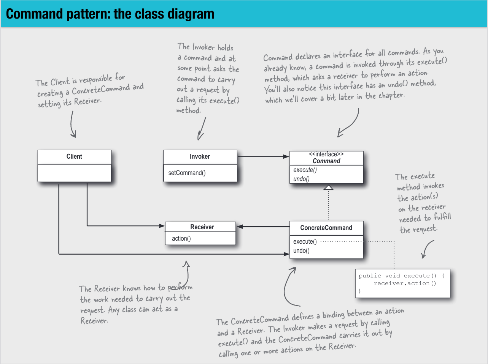
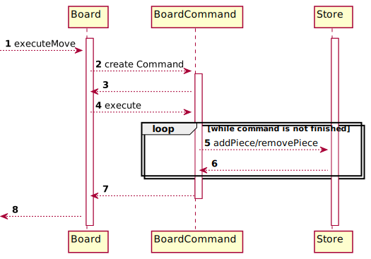
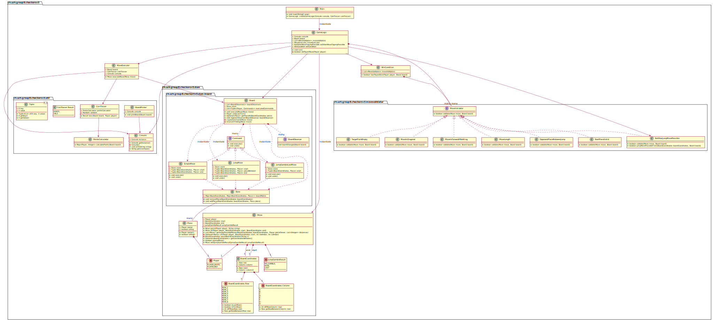

# Assignment 3

## Exercise 1

### Task

Choose two design patterns among those that we cover in class until the lecture on Nov 23 (included),
excluding the pattern you already implemented in Assignment 2 (e.g., Singleton). For each chosen design
pattern, you must have a corresponding implementation in your code. If not, refactor your code to include
it. Then, complete the following points:

### Design Pattern 1

#### Task 1

Write a natural language description of why and how the pattern is implemented in your code.

#### Description of why and how the pattern is implemented

For exercise 3, we would like to implement the undo command. For that we need a way to store
the mutations of the board in a list, that we can undo them later. Currently, we have 3 mutations which
are possible on the board:
1. Move a piece from BoardCoordinates A to BoardCoordinates B.
2. Make a jump move from BoardCoordinates A to BoardCoordinates C, which removes the Piece at BoardCoordinates B between
A and C.
3. When a jump gamble is lost, just remove the piece at the start of the jump move.

Additionally, both of them may result in a pawn being converted to a king.
In this step, instead of directly mutating the Board in the `Board::executeMove` method,
we will construct a command, then execute it. Later in exercise 3, we will store the executed command
at the end of the command list, than we can undo them in the reverse execution order.

We have a special case for the command pattern here, because the Client and the Invoker are the same
class and instance. Board is responsible for creating the correct instance of the Command,
which may be a JumpGambleLostMove, a JumpMove or a SimpleMove. It also sets the Receiver of the Command,
which is the Store, via the constructor of the command. This is the responsibility of the client.
Then it directly executes the command, which is the responsibility of the Invoker.

Below is the image of the command pattern as explained in the lecture to compare with our explanation.

#### Task 2

Make a sequence diagram of how the pattern works dynamically in your code

#### Sequence diagram

#### Task 3

Make a class diagram of how the pattern is structured statically in your code

#### Class diagram

### Design Pattern 2

#### Task 1

Write a natural language description of why and how the pattern is implemented in your code.

#### Description of why and how the pattern is implemented

For the second pattern, we use the Singleton pattern, because it's the easiest one.
Another advantage is that we can save the other patterns for later because of the
"excluding the pattern you already implemented" requirement.

Opinion of Lucius Bachmann:
I recommend to never use the Singleton antipattern, because it makes testing more difficult and
adds a globally accessible object to the whole module (and all dependant modules).
A better solution is to use a Dependency Injection framework like spring boot, the DI of quarkus or google juice,
because they have ways to ensure that only one instance of an object exists without making
testing harder. If that is not feasible due to the small size of a project, it's better to use "Pure DI"
[https://blog.ploeh.dk/2014/06/10/pure-di/](https://blog.ploeh.dk/2014/06/10/pure-di/)
and just instantiate the class once.

Because the Singleton pattern is dangerous, we use a class at the edge of our system
where we don't have to change much and it does not cause much damage.
For that we can use the Console class, which is anyway a wrapper around the
System.out.println function and the System.in InputStream, that allows us to write tests more easily.
Because the System.in InputStream does not document anything about Thread Safety, there should only be one
instance of Console. And that can be achieved with the Singleton pattern.

For the Singleton pattern in its eager variant, we make the constructor of a class
private, and instantiate a private static final field with the only instance of the class
which should be created. Then we offer a public static method getInstance where
the user of the class can get the instance.

#### Task 2

Make a sequence diagram of how the pattern works dynamically in your code

#### Sequence diagram

#### Task 3

Make a class diagram of how the pattern is structured statically in your code

#### Class diagram

Because the Singleton pattern is implemented in one class, the class diagram only consists of one class.

## Exercise 2

Consider ten important classes in your checkers game.

### Task 1

Describe why these classes are important in your system’s design and what their current responsibilities are
(you must use UML diagrams to support your description)

#### UML Diagram

#### Description of the 10 most important classes and their responsibilities

The 10 most important classes in are the following:

1. GameLogic
Controls the workflow of the game 
Responsibilities:
* Decide which players turn it is
* when to parse input
* when to decide if the chosen move is valid
* delegate the execution of gamble or not to MoveExecutor class
* when the win conditions should be checked
* terminate the game if the win condition was met
* decide which player has to be asked for the next input
2. Board
* Apply the valid changes applied by MoveExecutor
* Store the history of changes
* Apply the reversal of previous changes asked by GameLogic
* Decide if a piece converts to a king at the end of a move
3. Move
* Parse the input of the player and convert the text input into the domain language
* Store the start, the end, the player and the result of a possible gamble for a move
* Generate the possible moves of a given BoardCoordinate and distances for a player
* Calculate the coordinates between start and end of the move
* Decide if the move itself is a jump move
4. WinCondition
* Decide if the given player has won on the given board
5. MoveExecutor
* If the move to execute is a jump move, guide the player through the gamble process
* If the move is not a jump move, execute it without gamble process
6. Store
* Store the state of the board
* Remove a piece at BoardCoordinates
* Add a piece at BoardCoordinates
* Return the piece of given BoardCoordinates if there is one
7. BoardPrinter
* Print the current state of the Board to the console
8. NoOtherJumpMovePossible
* Check if no other jump move is possible for the player if he did not make a jump move.
* decide if a jump move is possible from the given coordinates
9. MoveIsDiagonal
* Check that the given move is diagonal
10. Main
* Instantiate the classes and start the game

### Task 2

Since these are important classes, you want to make sure that they are well tested! Write unit tests
to reach at least 80% line coverage in each of them. If this goal is not achievable (or not important),
you can explain why.

### Task 3

Create a testing report for your system with: (1) line coverage overall and (2) a histogram with the
distribution of the line coverage.

#### Overall line coverage report

The overall line coverage is currently 97 %.
The source of this coverage report is the jacoco coverage report tool,
of which the results can be seen in our continuous integration builds.
[Link to Builds](https://github.com/soco21/soco21-group8/actions?query=branch%3Amain)

#### Histogram of the line coverage distribution

## Exercise 3

### Undo Feature

#### Task 1

Google (used to?) ask their employees to spend 20% of their time at Google on a project that their
job description does not cover. As a result of the 20% Project, Google now has services such as
Gmail and AdSense.
This is your occasion to have similar freedom. You can decide what to do next to your game:5 It can
be an extension/improvement from any perspective, such as improved code quality or novel features.
Define your own requirements and get them approved by your tutor (especially in terms of load).
Afterwards you must implement the requirements.

##### Description of the requirements

To be able to improve one's checkers skills with our implementation of checkers, we will implement
the possibility to undo a turn. The simple use case is that Player WHITE makes his turn and hands over
the keyboard. Then Player WHITE realises, that his turn was not a good choice. Player WHITE asks player RED,
if he can try his turn again. If Player RED agrees, he types 'undo' instead of his move, and hands back the keyboard.

The second use case is if 2 Players want to test different strategies starting from a specific situation.
They may make their moves until they reach the specific situation, and then try a strategy to win the game
from this situation. Then they undo their moves again until they reach the situation again, and try a different one.

The undo command has 3 different outcomes depending on the moment when the undo command is used.

1. At the start of the game, there are no moves that can be undone. An error message is displayed and Player RED can
try again to enter a valid move.
2. A Player enters 'undo' instead of his first move in his turn. The last turn of the other player is undone, and the
other player may try other moves for his turn.
3. A Player enters 'undo' instead of a second (or more) jump move, or a second (or more) move for a won jump gamble move.
Then all the previous moves of his turn are undone, and the Player starts his turn again.

#### Task 2

During the analysis and design phases of this extension use responsibility driven design and UML
(push to the repository the single PDF file including all the produced documents)

##### Responsibility Driven Design

We have the following new responsibilities:

1. If the user types 'undo' into the console, we have to trigger the undo
This responsibility was given to the GameLogic class, as it already parses the input and triggers its effects
2. We have to store the executed commands
This responsibility was given to the Board class, as it already creates the correct Move Command
(JumpGambleLostMove, JumpMove, SimpleMove) and executes it.
3. When the undo is triggered, we need to iterate over the commands we need to undo and trigger that they are undone
This responsibility was given to the Board class.
4. For the 3 possible mutations of the board, we need to undo their respective effect.
This responsibility was given to the respective commands JumpGambleLostMove, JumpMove and SimpleMove.

##### UML

##### Sequence Diagram

##### Class Diagram

The changed classes are in green.

### Balanced Gamble Feature

#### Task 1

Google (used to?) ask their employees to spend 20% of their time at Google on a project that their
job description does not cover. As a result of the 20% Project, Google now has services such as
Gmail and AdSense.
This is your occasion to have similar freedom. You can decide what to do next to your game:5 It can
be an extension/improvement from any perspective, such as improved code quality or novel features.
Define your own requirements and get them approved by your tutor (especially in terms of load).
Afterwards you must implement the requirements.

##### Description of the requirements

To make the use of the gamble feature more interesting, we will increase the chances of the player
with fewer pieces for a successful gamble. For that we will calculate a score for each player.
For each normal piece, a player gets one point. For each king a player gets two points.
The chance of a player to win a gamble is calculated as follows:
winChance = (1 - (player score/total score on the board))

Example:
Player WHITE has 4 Pieces and 1 King, which is a score of 6.  
Player RED has 10 Pieces, which is a score of 10.  
If player WHITE gambles, he has a win chance of (1 -  6/16) = 10/16 = 62.5%  
If player RED gambles, he has a win chance of (1 - 10/16) = 6/16 = 37.5%  

#### Task 2

During the analysis and design phases of this extension use responsibility driven design and UML
(push to the repository the single PDF file including all the produced documents)

##### Responsibility Driven Design

We have 2 new Responsibilities:
1. calculate the score of the players.
This responsibility was given to the new class PointsCalculator.
2. Use the calculated score to influence the chance to win a gamble
This responsibility was given to the existing CoinTosser class.

##### UML

##### Sequence Diagram

##### Class Diagram

The changed classes are in green.

