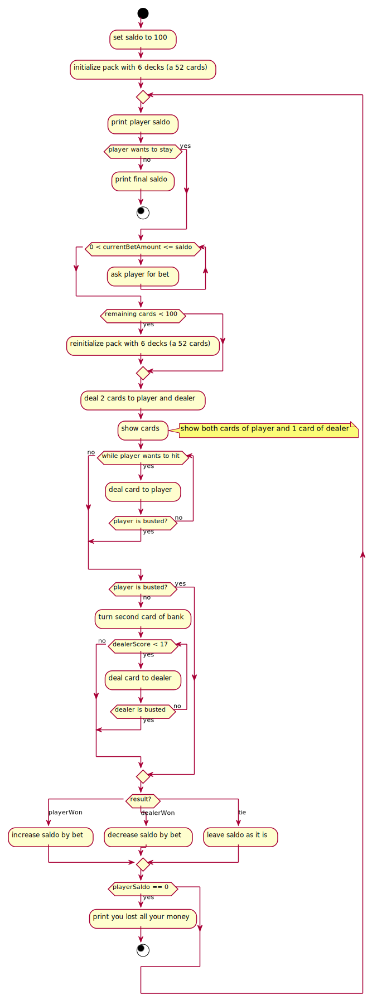
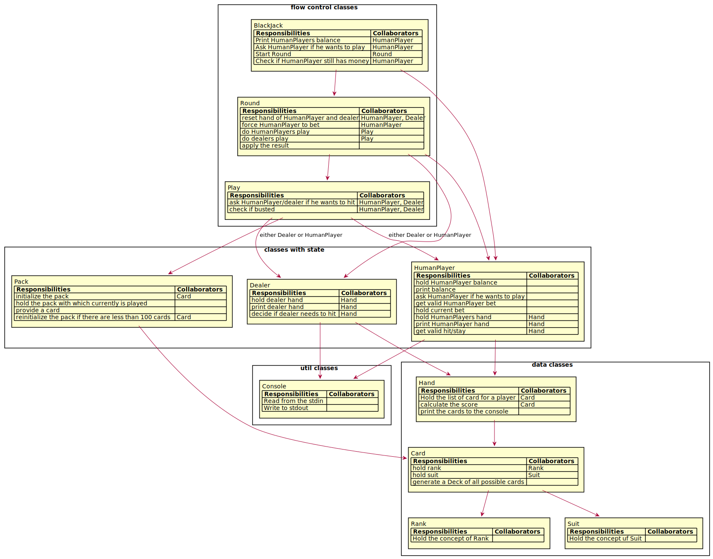
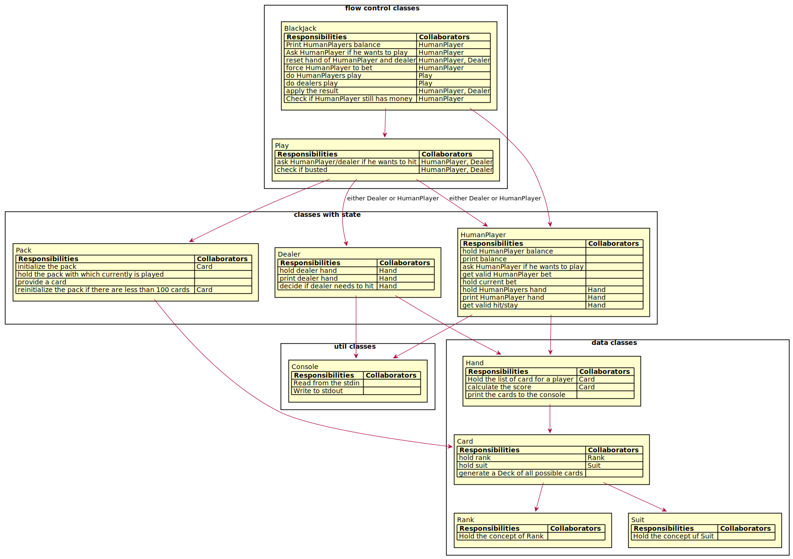
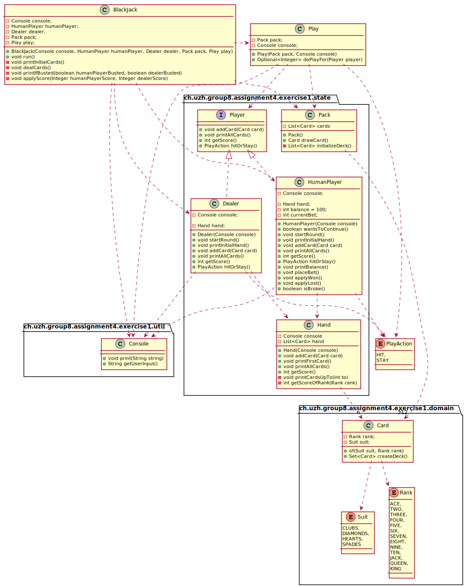
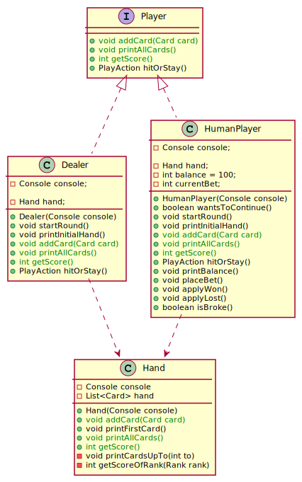

# Assignment 4

## Exercise 1

### The Design Process

From the initial description we derived the following responsibilities:
* Print Players balance
* Ask Player if he wants to play
* initialize the pack
* hold the pack with which currently is played
* provide a card
* reinitialize the pack if there are less than 100 cards
* hold Players balance
* Start Round
* reset hand of player and dealer
* get valid player bet
* hold current bet
* do players play
* hold players hand
* print player hand
* calculate the score of the hand
* check if busted
* ask player/dealer if he wants to hit
* get valid hit/stay for player
* do dealers play
* hold dealer hand
* print dealer hand
* decide if dealer needs to hit
* apply the result of the game to the players balance
* Check if Player still has money
* Read from the stdin
* Write to stdout
* generate a Deck of all possible card

Since blackjack is a game that involves cards, we took the concepts from the lecture on how cards and decks should
be represented in our system i.e. A deck consists of 52 cards and each card consists of a rank and a suit. So the 
first classes Rank, Suit, Card and Deck were set in stone, where Rank and Suit are to be enum classes. Then we looked
up in the internet (https://bicyclecards.com/how-to-play/blackjack/) how casinos handle decks of cards,
and learned that they often use multiple decks combined in a so-called pack. So we decided that the Deck as concept
and class is not really needed because it exists only temporarily as the set of all possible cards before combining
multiple decks into a pack.

With that out of the way, we wrote an activity diagram that we have an overview for what we will need loops, for what
we will need checks and when we want to make these checks.

With this in mind we came up with our initial crc cards where we distributed the responsibilities to the
classes we thought they belonged, and dividing up classes when they had too many responsibilities. The question arose
how to handle concepts of the player, the dealer, the hit or stay loop and the hand. Both the dealer and the player
need to hold a hand, calculate its score and need to choose to hit and stay. And we have to logic of the loop if the
player or dealer wants to hit or stay, then gets a card, and then we need to check if the score is > 21. But the player 
and the dealer have a different way of choosing if they want to hit or stay, and the player has additionally a balance
and the bet for the current round. One possibility would have been an abstract class with one possible name HandHolder,
but we did not find a good name for the abstract class and the player and the dealer still had differences, so we
decided to use the Delegation design pattern we found on GitHub (https://github.com/iluwatar/java-design-patterns/tree/master/delegation),
and extract the concept of the hand to a separate class. We will explain the Delegate pattern in the Design Patterns
chapter.  
The common interface of player and dealer will be exposed with the interface Player, and we rename
the class previously called Player to HumanPlayer. Like that we can move the hit or stay loop to a class Play, 
which uses the Player interface for the interactions needed for the hit or stay loop.

During the implementation, we saw that the class BlackJack would be tiny and merged it with the Round class.

### Design Patterns

One design pattern we used is the Delegation design pattern (https://github.com/iluwatar/java-design-patterns/tree/master/delegation)
, where HumanPlayer and Dealer expose the same methods as the Hand class, but the Hand class holds the implementation.
These methods are then exposed with a common public interface Player to the class Play. That way it's possible
to share functionality and a common interface without using inheritance in the case the classes don't have a
"is a" relationship, but share a "has a" relationship.

It was not necessary to use other design patterns for this BlackJack implementation.

### Additional Features

As an additional feature we use not only one deck of 52 cards, but 6. This helps to exercise card counting in a 
more realistic environment.

### Testing

We tested the most important classes with unit tests and achieved a line coverage of 92%.
